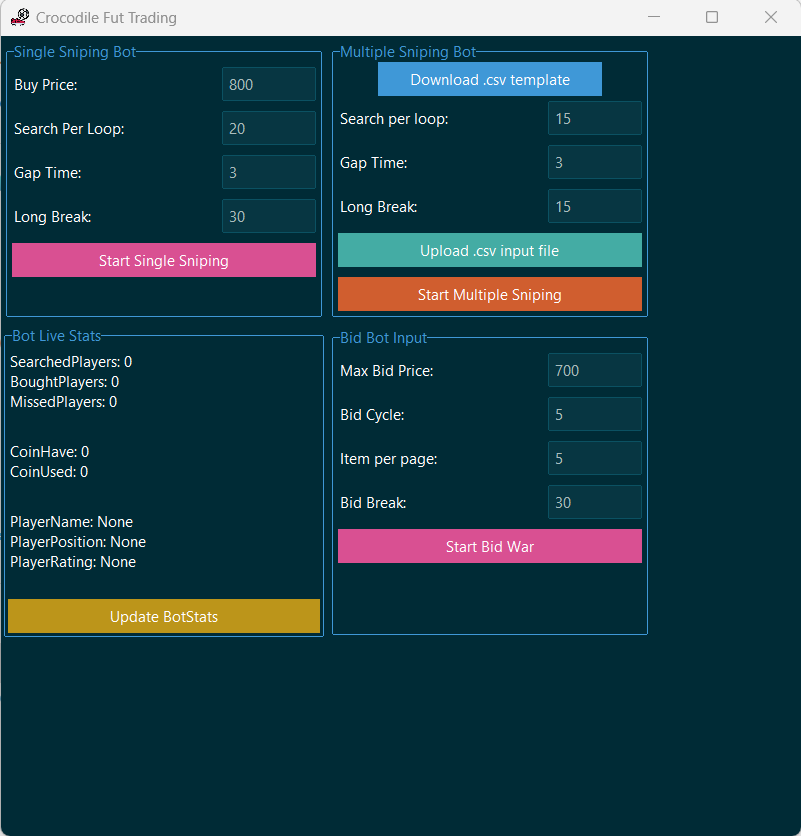

# Fifa 23: CrocodileFut


## Intro
This project is a trading bot that buys and sells players on the FUT (FIFA Ultimate Team) Transfer Market web application. 

Built in Python, this bot uses [Selenium](https://www.selenium.dev/documentation/en/) to interact with FUT Webapp via [ChromeDriver](https://www.chromium.org/) and uses [Tkinter](https://wiki.python.org/moin/TkInter) as user interface


## Overview & Features
CrocodileFut facilitate different kinds of methodology to trade in the market. Some methodologies including but not limited to:
- Buy Low get High 
- Follow the trend (SBC supply demand etc.)
- Statistical arbitrage between different data providers (FUTBIN, FUTWIZ, FUTHEAD, WEFUT etc.)
- Market making special card
- Sniping high-end card

Algorithms can be executed within UI with bid war or sniping war, with random generator waiting time and customized setup (wait time, search per loop, break, etc.):




You can perform algorithmic trading with simple excel inputs. 

For example, you want to snipe multiple card with predefined attributes and predefined flooring prices, then you can inject the excel files as below into CrocodileFut:

| name             | quality | rarity                     | position    | chemistry | nationality | league                    | club | BuyPrice |
|------------------|---------|----------------------------|-------------|-----------|-------------|---------------------------|------|----------|
|                  |         | TEAM OF THE SEASON MOMENTS |             |           |             | LaLiga Santander (ESP 1)  |      | 26000    |
|                  |         | Team of the Season         |             |           |             | Premier League (ENG 1)    |      | 24000    |
|                  |         | Team of the Season         | Midfielders |           |             | LaLiga Santander (ESP 1)  |      | 29000    |
|                  |         | TEAM OF THE SEASON MOMENTS | CB          |           | France      | Bundesliga (GER 1)        |      | 29000    |
|                  |         | Team of the Season         | GK          |           |             | Ligue 1 Uber Eats (FRA 1) |      | 26000    |
| Saeed Al Owairan |         |                            |             |           |             |                           |      | 17000    |
|                  |         | TEAM OF THE SEASON MOMENTS | Defenders   |           |             | LaLiga Santander (ESP 1)  |      | 28000    |
|                  |         | TEAM OF THE SEASON MOMENTS | Defenders   |           |             | Premier League (ENG 1)    |      | 25000    |
|                  |         | FUT Heroes                 | Defenders   |           |             |                           |      | 14000    |
|                  |         | FUT Heroes                 | GK          |           |             |                           |      | 13000    |
|                  |         | Team of the Season         |             |           |             |                           |      | 15000    |
|                  |         | Team of the Season         |             |           |             |                           |      | 16000    |
|                  |         | Team of the Season         |             |           |             |                           |      | 16000    |
|                  |         | Team of the Season         |             |           |             |                           |      | 16000    |
|                  |         | TEAM OF THE SEASON MOMENTS |             |           |             | Premier League (ENG 1)    |      | 26000    |
|                  |         | World Cup Hero             |             |           | Argentina   |                           |      | 32000    |
|                  |         | World Cup Hero             |             |           | Netherlands |                           |      | 32000    |


## Running the bot
If you have python, just install required packages, modify the main.cmd file. Below is example from mine

```console
@echo off

set SCRIPTDIR=%~dp0
set LIBDIR = %E:/ProgramData/Anaconda3/
set PYTHONPATH=%LIBDIR%

(
call cd /d ".CrocodileFut/"
echo "Set script dir to %SCRIPTDIR% and python path to %LIBDIR%"
call C:\ProgramData\anaconda3\Scripts\activate.bat
echo "Activate environment: "
echo "Running: python - m main.py"
call conda activate CrocodileFut
call python ./main.py
@REM python main.py %*
)
cmd /k
```

## Guide for developers

I used Visual studio code with conda packages management as below:

```console
conda create --name CrocodileFut
conda activate CrocodileFut
conda list -n CrocodileFut
conda list


conda install pandas
conda install selenium
pip install tk
pip install ttkbootstrap
pip install undetected-chromedriver
pip install webdriver-manager
```
 The workspace path is setup as follow:


## Roadmap for EAFC24: Any improvement, ideas are welcomed!